# Анализ заголовка исполняемого файла

## Цель работы

Изучить формат PE (Portable Executable) — стандартный формат исполняемых файлов Windows. Написать парсер, который читает PE-файл и выводит информацию об его заголовках, таблицах импортов и экспортов, секциях, релокациях и ресурсах.

---

## Теоретическая часть

### Формат PE

PE (Portable Executable) — формат исполняемых файлов, используемый в операционных системах Windows. В данном формате хранятся `.exe`, `.dll`, `.sys` и другие исполняемые файлы. Структура PE-файла содержит всю информацию, необходимую системному загрузчику для размещения файла в оперативной памяти и его запуска.

PE-файл состоит из следующих основных частей:

- **DOS-заголовок** — заголовок, унаследованный от формата MS-DOS
- **NT-заголовок** — основной заголовок PE-файла, содержащий сигнатуру, File Header и Optional Header
- **Таблица секций** — массив заголовков секций
- **Секции** — непосредственно данные: код, данные, ресурсы и т.д.

### RVA (Relative Virtual Address)

RVA — относительный виртуальный адрес, то есть смещение в байтах от базового адреса загрузки PE-файла в память (`ImageBase`). Для чтения данных из файла на диске необходимо переводить RVA в физическое смещение внутри файла через таблицу секций.

---

## Реализация

Парсер написан на языке C#. Для чтения структур из массива байт используется `Marshal.PtrToStructure<T>()`. Все структуры PE-формата объявлены с атрибутом `[StructLayout(LayoutKind.Sequential, Pack = 1)]` для точного соответствия бинарному формату.

Парсер принимает один или несколько файлов в качестве аргументов командной строки и последовательно обрабатывает каждый из них:

```
PEParser.exe file1.exe/dll file2.exe/dll
```

---

## Описание шагов

### Шаг 1 — DOS-заголовок

Файл читается целиком в массив байт. Начало файла интерпретируется как структура `DosHeader`.

Ключевые поля:
- `e_magic` — сигнатура `0x5A4D` ("MZ"), подтверждает что файл является PE-файлом
- `e_lfanew` — смещение от начала файла до NT-заголовка

Если `e_magic` не равно `0x5A4D` — файл не является PE-файлом, парсер завершает работу с ошибкой.

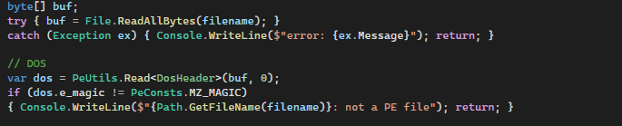

---

### Шаг 2 — NT-заголовок и File Header

По смещению `e_lfanew` расположен NT-заголовок. Его структура:

1. 4 байта сигнатуры — `0x00004550` ("PE\0\0")
2. Структура `IMAGE_FILE_HEADER`
3. Структура `IMAGE_OPTIONAL_HEADER`

Из `FileHeader` извлекаются следующие поля:

| Поле | Описание |
|------|----------|
| `Machine` | Архитектура процессора: `0x014C` — x86, `0x8664` — AMD64 |
| `NumberOfSections` | Количество секций в файле |
| `TimeDateStamp` | Дата компиляции в формате Unix timestamp |
| `Characteristics` | Атрибуты файла (исполняемый, DLL и др.) |

Поле `Characteristics` разбирается побитово — каждый установленный бит соответствует определённому флагу, например `EXECUTABLE`, `DLL`, `LARGE_ADDRESS_AWARE`.

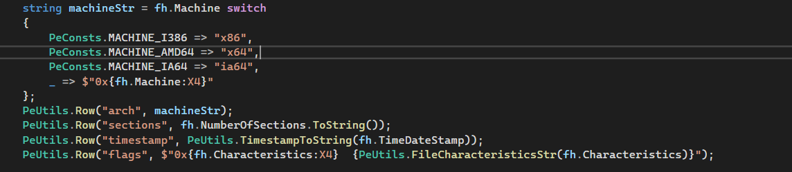
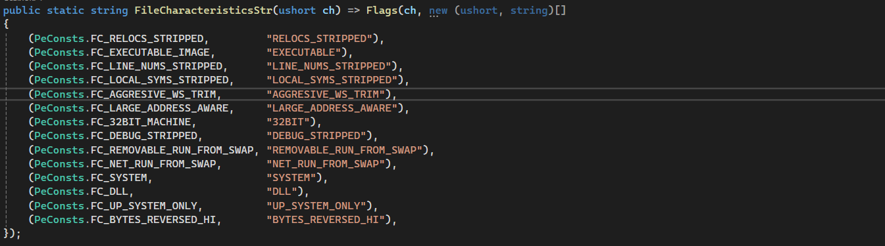

---

### Шаг 3 — Optional Header

Optional Header — наиболее важный заголовок PE-файла, несмотря на своё название. Для 32-битных и 64-битных файлов структуры различаются (`OptionalHeader32` и `OptionalHeader64`), поэтому тип определяется по полю `Machine` из File Header.

Извлекаемые поля:

| Поле | Описание |
|------|----------|
| `Magic` | Тип файла: `0x10B` — PE32 (32-bit), `0x20B` — PE32+ (64-bit) |
| `AddressOfEntryPoint` | RVA точки входа в программу |
| `ImageBase` | Предпочтительный адрес загрузки образа в память |
| `SectionAlignment` | Выравнивание секций в памяти |
| `FileAlignment` | Выравнивание данных в файле |
| `SizeOfImage` | Полный виртуальный размер образа в памяти |
| `DllCharacteristics` | Атрибуты безопасности: ASLR, DEP, CFG и др. |

Поле `DllCharacteristics` также разбирается побитово — выводятся флаги `DYNAMIC_BASE`, `NX_COMPAT`, `TERMINAL_SERVER_AWARE` и другие.
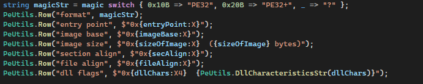
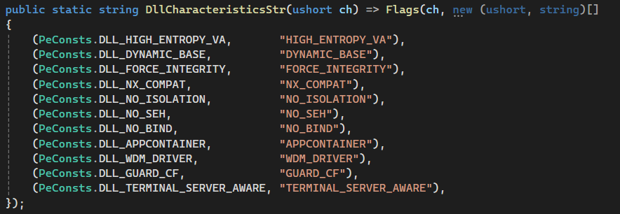
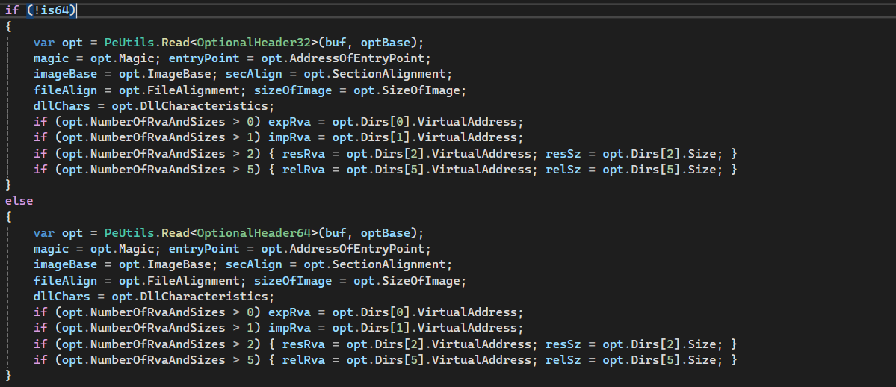

---

### Шаг 4 — Перевод RVA в смещение файла

Для чтения таблиц импортов, экспортов и других директорий необходимо переводить RVA в физическое смещение внутри файла. Реализована функция `RvaToOffset()`:

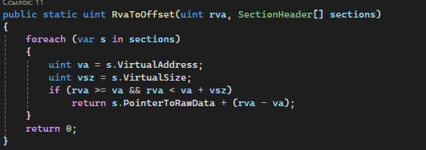

Функция перебирает все секции и проверяет, попадает ли RVA в диапазон виртуальных адресов секции. Если да — вычисляет физическое смещение как `PointerToRawData + (rva - VirtualAddress)`.


---

### Шаг 5 — Таблица экспортов

Таблица экспортов описывается структурой `ExportDirectory` и содержит три параллельных массива:

- `AddressOfFunctions` — RVA экспортированных функций
- `AddressOfNames` — RVA строк с именами функций
- `AddressOfNameOrdinals` — порядковые номера функций

Для каждой экспортируемой функции выводится ordinal, RVA и имя. Если таблица экспортов отсутствует (RVA равен нулю) — выводится `none`.

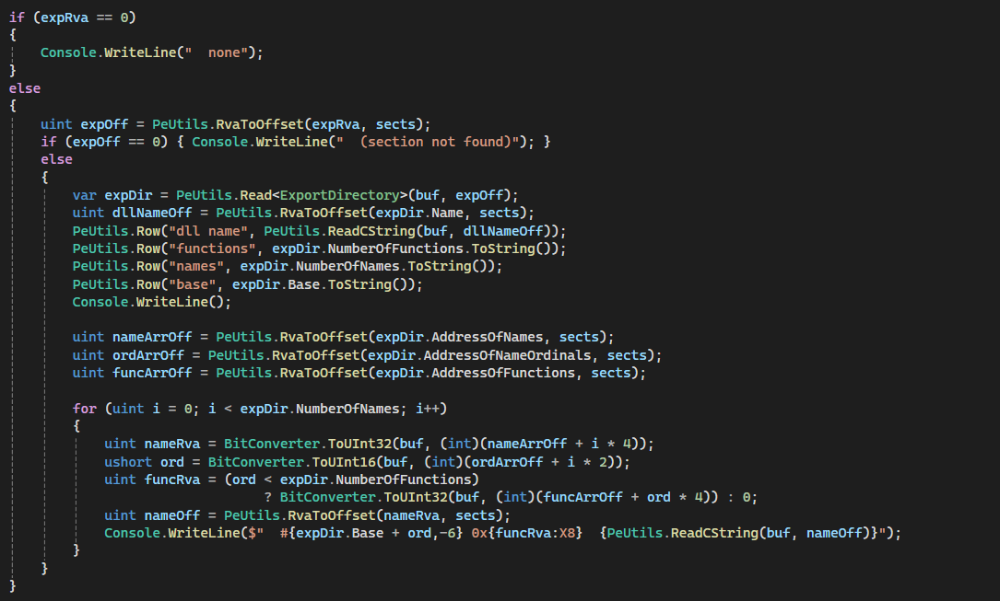

---

### Шаг 6 — Таблица импортов

Таблица импортов — массив структур `ImportDescriptor`, завершающийся нулевым дескриптором. Каждый дескриптор описывает одну импортируемую DLL.

Поле `OriginalFirstThunk` указывает на массив структур `ImportByName`. Каждый элемент массива — либо импорт по имени, либо импорт по ordinal (если установлен старший бит: `0x80000000` для 32-bit, `0x8000000000000000` для 64-bit).

Для каждой DLL выводится её имя и список импортируемых функций.

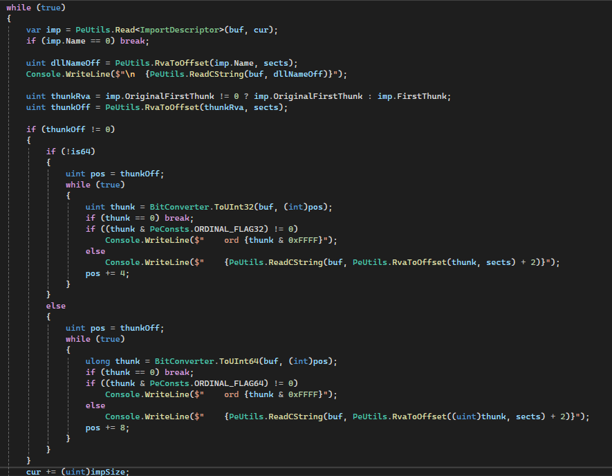

---

### Шаг 7 — Релокации и ресурсы

Информация о релокациях и ресурсах берётся из массива `DataDirectory` в Optional Header:

- **Релокации** (индекс 5) — таблица базовых релокаций. Необходима если образ загрузился по адресу, отличному от `ImageBase`, для пересчёта жёстко заданных адресов.
- **Ресурсы** (индекс 2) — секция ресурсов, содержащая иконки, строки, диалоги и прочие встроенные данные.

Если RVA директории не равен нулю — выводится её адрес и размер.

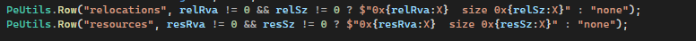
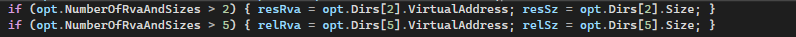

---

### Шаг 8 — Секции

После NT-заголовка расположен массив структур `IMAGE_SECTION_HEADER`, по одной на каждую секцию. Количество секций задаётся полем `NumberOfSections`, каждая структура занимает 40 байт.

Для каждой секции выводится:

| Поле | Описание |
|------|----------|
| `Name` | Имя секции (до 8 байт, не обязательно null-terminated) |
| `VirtualAddress` | RVA начала секции |
| `VirtualSize` | Размер секции в памяти |
| `SizeOfRawData` | Физический размер секции в файле |
| `Characteristics` | Флаги доступа: `r` — чтение, `w` — запись, `x` — исполнение |

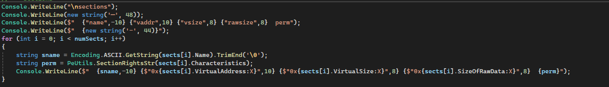
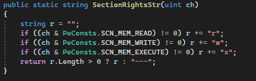

---

## Пример вывода

```
notepad.exe
────────────────────────────────────────────────
  arch                     x64
  sections                 3
  timestamp                2023-05-10 14:22:01
  flags                    0x0022  EXECUTABLE LARGE_ADDRESS_AWARE
  format                   PE32+
  entry point              0x1234
  image base               0x140000000
  image size               0x8000  (32768 bytes)
  section align            0x1000
  file align               0x200
  dll flags                0x8160  DYNAMIC_BASE NX_COMPAT TERMINAL_SERVER_AWARE

exports
────────────────────────────────────────────────
  none

imports
────────────────────────────────────────────────

  KERNEL32.dll
    CreateFileW
    ReadFile
    CloseHandle

sections
────────────────────────────────────────────────
  name            vaddr    vsize  rawsize  perm
  --------------------------------------------
  .text        0x1000   0x5A00   0x5C00  rx
  .rdata       0x7000   0x1200   0x1400  r
  .data        0x9000    0x400    0x200  rw

misc
────────────────────────────────────────────────
  relocations              none
  resources                0x8000  size 0x3C0
```

---

## Вывод

В ходе работы был изучен формат PE-файлов и написан парсер на языке C#, который разбирает DOS-заголовок, NT-заголовок, Optional Header, таблицы импортов и экспортов, секции, а также проверяет наличие релокаций и ресурсов. Были реализованы побитовый разбор флагов характеристик файла и DLL, перевод RVA в физические смещения, а также поддержка как 32-битных (PE32), так и 64-битных (PE32+) исполняемых файлов.
